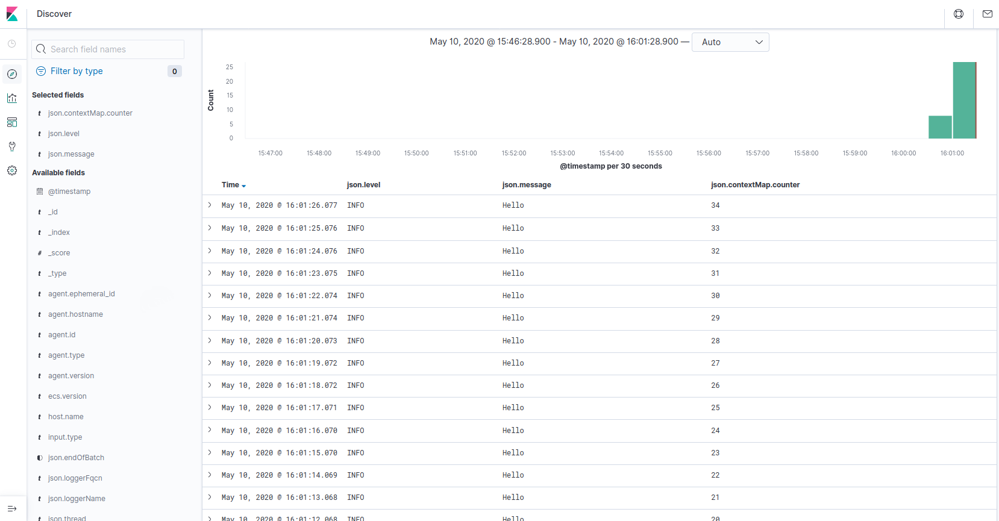

# HowTo log4j-filebeat

HowTo log Java-Applications with log4j 2 to filesystem and import the logs to elasticsearch.

- Logging Java-Application with log4j and custom var "counter"
- Configuration over external log4j2.properties
- Log JSON to filesystem
- Read logs with filebeat
- Push logs to elasticsearch
- Visualize logs with kibana

## Requirements
- Docker
- Docker Compose

## Use
1. Run ```docker-compose up -d```. This will build the example-application and start filebeat, elasticsearch.
1. Call ```http://localhost:5601``` with your browser.
1. Add index "filebeat-*"
1. You can see the fields from the logs.

